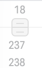
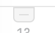
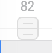
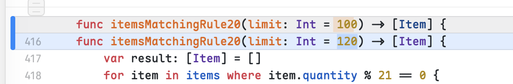
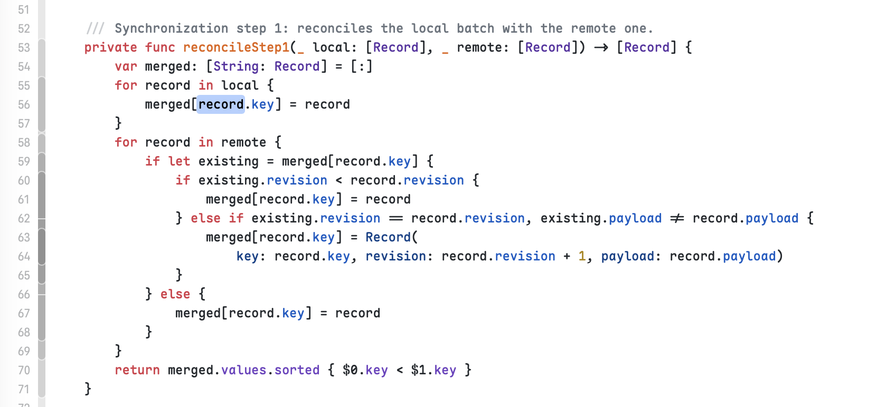
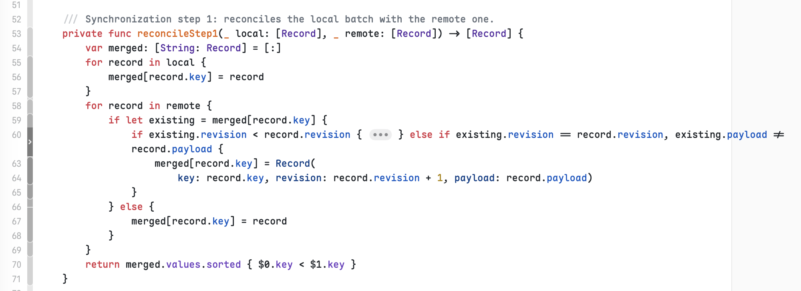
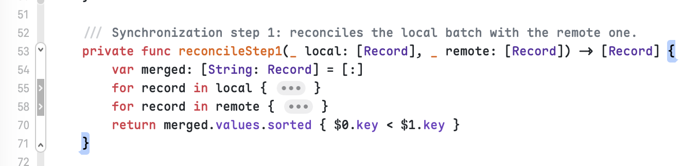
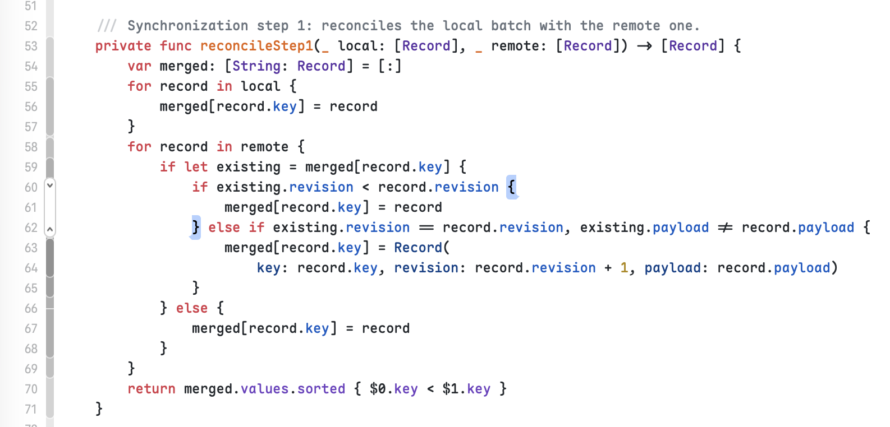
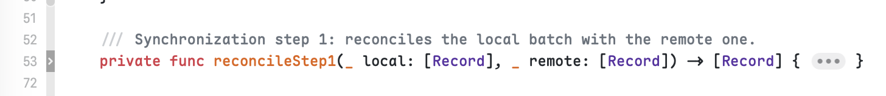
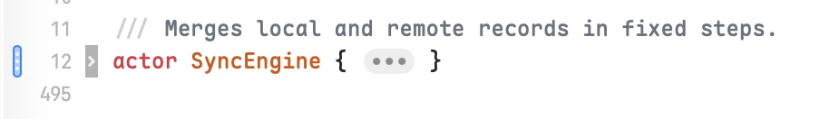

# Xcode reference: gap handles, the fold ribbon and inline changes

Screenshots the user took on 09-23 from Xcode 26.6, of the throwaway project in
`~/Developer/experimental/010.xcode-diff-playground`. They are the visual reference for the roadmap's
"Diff interaction refinements" (DIFF-02 to DIFF-04). Images are in `assets/xcode-reference/`.

## Gap handles (DIFF-02)

- **A band of its own:** the hidden run takes an empty band between the two visible lines around it, with no text,
  no tint and no line number. It is 19 pt tall against Xcode's 18 pt lines, one line and its hairline. Measured at
  2× on these screenshots: lines 18 and 237 lie 37 pt apart, against 18 pt between 237 and 238, and the handle fills
  exactly the 19 pt between them. In the inline change screenshot, the lower half ends on the pixel where the
  changed line begins. Line numbers jump across the band (18, then 237).
- **Shape:** one rounded rectangle, 18 × 19 pt, as tall as the band and centred across the gutter. A 1 pt hairline
  crosses the band's middle and the whole gutter, and splits the rectangle into two halves of 9 pt. The corners are
  4 pt, the outline 1 pt. Each half carries one 8 pt grip line, 5 pt and 14 pt below the band's top. On the white
  gutter, the outline and the grips are 221, the fill 245 and the hairline 241.
- **Which half does what:** the upper half extends the change above, and is dragged down. The lower half extends
  the change below, and is dragged up. Each half's rounded corners face the change it extends; its flat side lies
  on the hairline, facing the direction it is dragged.
- **One direction only:** where a run can grow from one side alone, only that half is drawn, 13 pt tall, and the
  hairline moves near the band's far edge. At the top of the file (above line 12), the lower half hangs under the
  hairline, flat side up with its own outline, rounded corners toward line 12. The capture shows 5 pt of empty
  space above the hairline, which makes the band 19 pt again. No capture shows the end of a file; ours mirrors the
  top, with the upper half on a hairline 5 pt above the band's bottom. Above a change with a run on each side
  (line 82), both halves show.

Our version: the user first had the run take no row, with the handle over the lines around its hairline, then chose
Xcode's band on 09-23. The band is one line and the hairline tall, so it scales with the theme's line height: 16 pt
at our 15 pt lines, 19 pt at 18 pt ones. Two halves take (band − 1) / 2 each, and a lone half 13/18 of a line. Each
half hovers and drags on its own, and its part of the band, across the gutter, is where it takes the pointer. The
rows around the band keep their own clicks. A drag never discloses lines against its half's direction, and a half
held at an edge keeps revealing at a bounded rate. The count of hidden lines, which the removed row used to show,
moves to the handle's tooltip.

## Inline change and intraline emphasis

- **Old line:** a light gray background, and no line number.
- **New line:** a light blue background, and its line number (416).
- **Changed tokens:** tan on the old line (`100`) and blue on the new line (`120`).
- **Change bar:** a solid blue bar at the gutter's leading edge spans the change, old and new lines together.

This is Xcode's modification look. It differs from our red and green palette, and could become an "Xcode" diff
palette to match the Xcode badge scheme (SET-07). That idea is not requested yet.

## Fold ribbon (DIFF-03)

- **Place:** a narrow strip between the line numbers and the text.
- **Depth:** each line's segment is shaded by nesting depth, and deeper scopes are darker grays. A hairline marks
  where a scope ends (line 66).
- **Wrapped lines:** a folded or wrapped line (60) keeps a single ribbon segment across its visual rows.

- **Hover:** outlines the scope under the pointer as a rounded capsule in the ribbon, with a `⌄` at its first line
  and a `⌃` at its last. The scope's opening and closing braces light up in blue in the text.
- **Hover precision:** it works at any depth. Hovering the inner `if` (lines 60 to 62) outlines only that block.

- **Folded scope:** shows a dark tab with `›` in the ribbon, and a gray `•••` capsule in the text between the
  braces. Line numbers jump (53, then 72).
- **Changes inside a fold:** a scope with changes inside it keeps a dotted blue change bar at the gutter's edge
  (`actor SyncEngine`, lines 12 to 495). A fold never hides that something changed.

Our version: the ribbon shares the gutter with line numbers, the change bar and diagnostics tints without widening
it much. That is why the gutter's spacing is to be reworked into layers with dedicated sides.

## Compact inline view (DIFF-04)

No Xcode screenshot covers it. It reuses the ribbon's visual language, meaning the markers, the tab and the capsule,
to flag where changes are in a view that shows only the new content. Clicking a marker discloses the change in
place.
